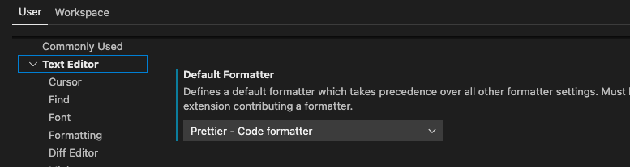
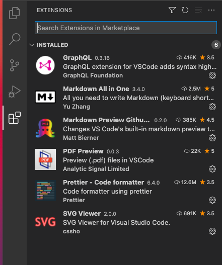

<h1>hirokoymj.com</h1>

## URL

https://www.hirokoymj.com

## Back-end

**Apollo Server**

https://hirokoymj-backend.herokuapp.com/

**Back-end repository**

https://github.com/hirokoymj/hirokoymj-backend

## Database

[MongoDB Atlas](https://www.mongodb.com/cloud/atlas)

## Cloud Server

[Heroku](https://dashboard.heroku.com/apps)

## Technologies

**Front-end**

- React, Redux, Redux-Form, React-Router, Apollo Client, Lodash, Moment.js, Google Map API, OpenWeatherMap API, Express.js(Live Server), Enfoced HTTPS

**Back-end**

- Apollo Server, GraphQL, MongoDB, Mongoose, REST API, dotEnv

## Screenshot - desktop

## Screenshot - mobile

## VC Code Extension

### Prettier - Code formatter

1. Installing `Prettier Code formatter`.
2. To enable Prettier, go to Code -> Preferences -> Settings -> User -> TextEditor.
3. Find `Default Formatter` in Text Editor and then select "Prettier-Code formatter".
4. Done!

### GraphQL

### SVG Viewer

### Markdown All in One

### Markdown Preview GitHub Styling

