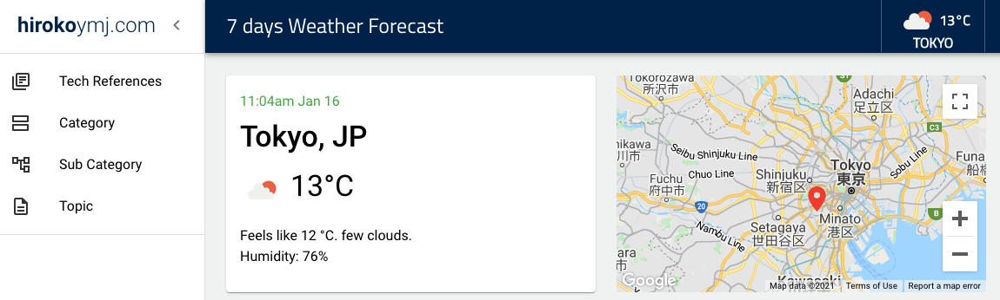
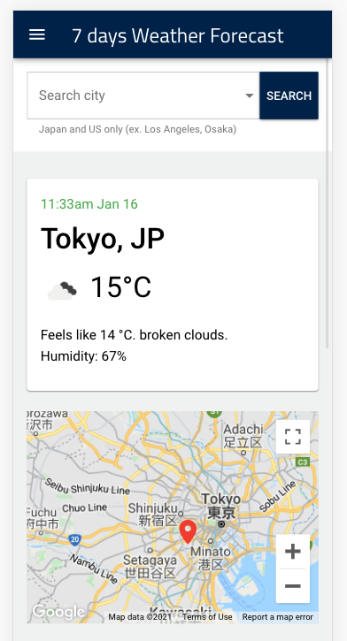

# hirokoymj.com

- URL: https://www.hirokoymj.com
- GraphQL API: https://hirokoymj-backend.herokuapp.com/
- GraphQL API repo: https://github.com/hirokoymj/hirokoymj-backend
- Database: [MongoDB Atlas](https://www.mongodb.com/cloud/atlas)
- Cloud Server: [Heroku](https://dashboard.heroku.com/apps)

### UI Structure

- **Container**: A Container component is to make a page view. Each router calls a container component.

- **Component**: A component is a piece of UI such as a button and form that is customized by Material UI.

- **Material UI**: Material UI is the UI library to build an own designed web application faster.

- **Redux**: Redux is to provide global variables to be directly accessible from any components.

- **Apollo Client**: Enable to get data from database using GraphQL.

### Run localhost

```js
yarn dev
```

http://localhost:3000/

### Screenshot





**Bug fix**

1. [TopicView] The data of the table won't refresh after deleting. Need to check delete mutation. Selected filter options should be added in redux. - Fixed
2. [CategoryView, SubCategoryView] - Has same issues of 1.
3. A title when open a drawer. **Fixed**
4. [Category Filter] - add space between each selected chip.

### TypeScript

https://www.newline.co/@bespoyasov/how-to-use-fetch-with-typescript--a81ac257

### Covid API

GET: Historical Data for all Counties in a Specified State

```js
https://corona.lmao.ninja/v2/historical/usacounties/:state?lastdays=30
```

GET: USA states to query /historical/usacounties/{state} endpoint

```js
https://corona.lmao.ninja/v2/historical/usacounties
```

### History

- 2.18.2022: Creating the axios custom hook for Covid-19 chart page
